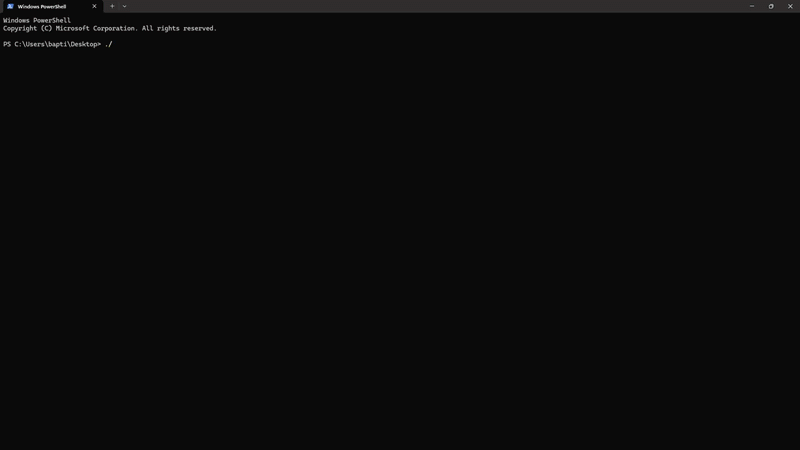

# LLSQL

**LLSQL (Local SQL)** is a lightweight command-line tool designed for working with SQL and local SQLite databases directly from your console.

## Demo



---

## Installation

1. Go to the project's **Releases** page.
2. Download the distribution corresponding to your operating system.
3. Extract the downloaded folder.
4. Add the executable to your system's `PATH`, or simply run the provided installation script:
   * **Linux / macOS:** 
     ```bash
     ./setup.sh
     ```
   * **Windows:** 
     ```cmd
     setup.bat
     ```

> **Note:** The installation script may not work correctly if your system's `PATH` is not properly configured.

---

## Usage

Everything is done directly from the console. 

Run LLSQL using the following syntax:

```bash
./llsql <databasename>
